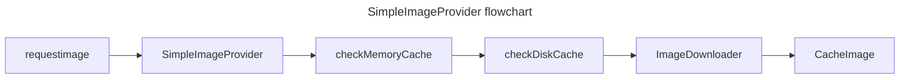
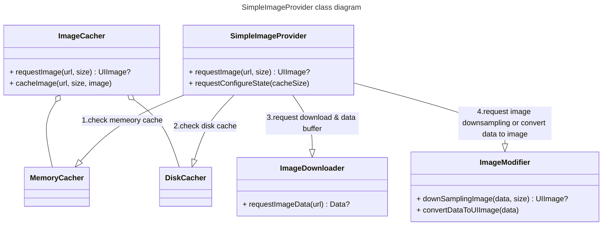

## Simpe image provider

간편하게 이미지를 UI로 표현할 수 있는 이미지 캐싱 라이브러리입니다.

| 항목            | 내용                       |
|-----------------|----------------------------|
| **지원 iOS 버전** | iOS 15.0 이상             |
| **사용한 기술**   | Swift, Swift Concurrency   |
  

## SimpeImageProvider 라이브러리를 사용중인 서비스

| 항목            | 링크                       |
|-----------------|----------------------------|
| **케어밋** | [앱스토어](https://apps.apple.com/kr/app/%EC%BC%80%EC%96%B4%EB%B0%8B/id6670529341)             |

## how to use

`SimpleImageProvider.shared` 싱글톤 객체에 접근하여 해당 라이브러리의 기능을 사용할 수 있습니다.

메모리 캐싱 사이즈, 디스크 캐싱 사이즈, 오버플로우시 정책을 **앱을 시작하기전 설정하길 권장**합니다.

해당 코드를 다른 런타임 공간에서 실행할 경우 예기치 못한 동시성 문제가 발발할 수 있습니다.

```swift
class AppDelegate: NSObject, UIApplicationDelegate {
    
    func application(_ application: UIApplication, didFinishLaunchingWithOptions launchOptions: [UIApplication.LaunchOptionsKey : Any]? = nil) -> Bool {

        SimpleImageProvider.shared.requestConfigureState(
            maxCacheImageCount: 50,
            maxDiskImageCount: 100,
            percentToDeleteWhenDiskOverflow: 20.0
        )
        
        return true
    }
}
```

### SwiftUI 코드

**SwiftUI**에서 사용가능한 `SimpleImage View`가 구현되어 있습니다.

```swift
LazyVGrid(columns: columns) {
    
    ForEach(items, id: \.self) { item in
        
        SimpleImage(
            url:"your image url",
            size: .init(width: 100, height: 100),
            fadeOutduration: 0
        )
            .frame(width: 100, height: 100)
            .background(Color.gray.opacity(0.5))
            .cornerRadius(5)
    }
}
```


### UIkit 코드

UIImageView의 확장자로 간편하게 접근이 가능합니다.

```swift
func setImage(url: String, size: CGSize) {
    
    uiImageView
        .simple
        .setImage(url: url, size: size, fadeOutDuration: 0.2)
}
```


### 코드로 접근

UI라이브러리가 아닌 코드로 접근하는 경우 싱글톤 객체를 활용하시길 바랍니다.

싱글톤 객체 자체는 동시성에 최적화되어 있습니다.

```swift
await SimpleImageProvider.shared.requestImage(...)
```

## Tech features

- 메모리 캐싱
  `NSCache`를 사용하여 자주사용되는 이미지를 메모리에 캐싱합니다.

- 디스크 캐싱
  `FileManager`를 사용하여 이미지를 디스크에 캐싱하고 LRU방식으로 관리합니다.

- 다운 샘플링
  이미지 요청시 전달한 `CGSize`를 사용하여 전달 받은 이미지를 샘플링 합니다.
  
  ※ 샘플링이 완료된 이미지가 캐싱됩니다.

### 사이즈 기반 이미지 캐싱

디스크 및 메모리에 캐싱되는 이미지는 **다운 샘플링이 적용된 이미지가 캐싱**됩니다.

동일한 이미지이지만 샘플링 결과에따라 다르게 캐싱을 진행합니다.

아래 캐싱키 값에 다운샘플링 사이즈가 포함되는 것을 확인할 수 있습니다.

```swift

func createKey(url: String, size: CGSize?) -> String {
    
    var keyString = url
    
    if let size {
        
        let width = size.width
        let height = size.height
        
        keyString += "\(width)x\(height)"
    }
    
    return keyString
}

```

### 다운 샘플링

이미지 다운 샘플링은 다운로드 받은 데이터 버퍼를 `CGImageSource`로 변경합니다.

`CGImageSource`를 특정 사이즈의 썸네일(원본보다 작은/축약된 이미지)로 변경하는 작업을 통해 다운 샘플링을 진행합니다.

※ 이미지 캐싱을 직접관리하기 위해 이미지소스생성시와 썸네일 생성시 추가적인 캐싱옵션을 모두 해제했습니다.

```swift

func downSamplingImage(dataBuffer: Data, size: CGSize) async -> UIImage? {
    
    let imageSourceOptions = [kCGImageSourceShouldCache: false] as CFDictionary
    
    guard let imageSource = CGImageSourceCreateWithData(dataBuffer as CFData,
imageSourceOptions) else {
        
        return nil
    }
    
    let biggerLength = max(size.width, size.height)
    let scale = await UIScreen.main.scale
    let maxDimensionInPixels = biggerLength * scale
    let downsampleOptions = [
        kCGImageSourceCreateThumbnailFromImageAlways: true,
        kCGImageSourceShouldCacheImmediately: false,
        kCGImageSourceCreateThumbnailWithTransform: true,
        kCGImageSourceThumbnailMaxPixelSize: maxDimensionInPixels
    ] as CFDictionary
    
    guard let downsampledImage = CGImageSourceCreateThumbnailAtIndex(imageSource, 0,
downsampleOptions) else {
        return nil
    }
    let image = UIImage(cgImage: downsampledImage)
    
    return image
}

```


### 플로우 차트



이미지 획득과정은 다음과 같이 진행되며 `이미지 획득 실패시 다음단계`로 넘어갑니다.
1. 이미지 요청
2. 메모리 캐시 체크
3. 디스크 캐시 체크(디스크 캐시 발견시 해당 이미지를 곧바로 메모리에 캐싱합니다.)
4. 이미지 다운로드
5. 다운로드된 이미지 캐싱

### 오브젝트 맵


